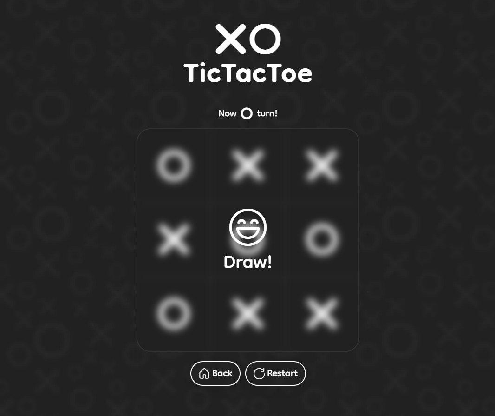

# TicTacToe


**This is my first TypeScript project!**



## Running this project

### First install the dependencies simply by running

```bash
yarn
```

`Tho, make sure that yarn in installed on your computer`

### Next, run the project

```bash
yarn start
```

### `Done!`
